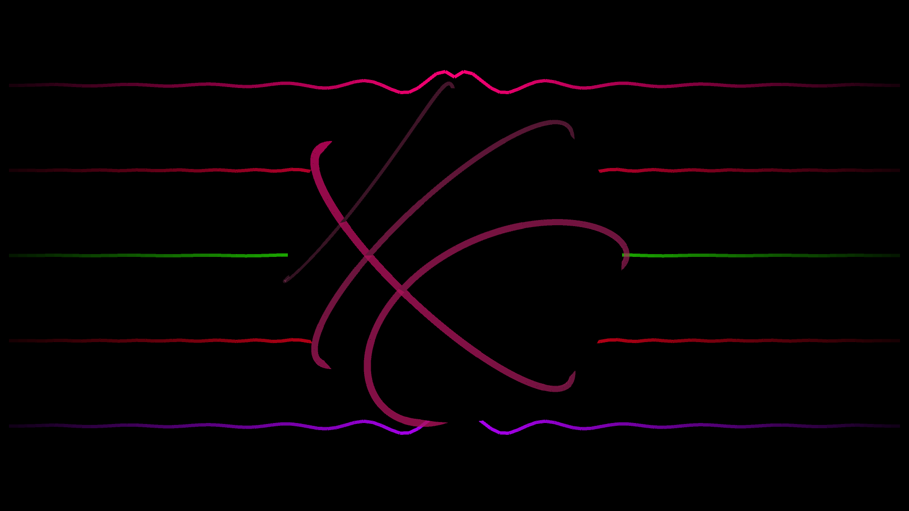
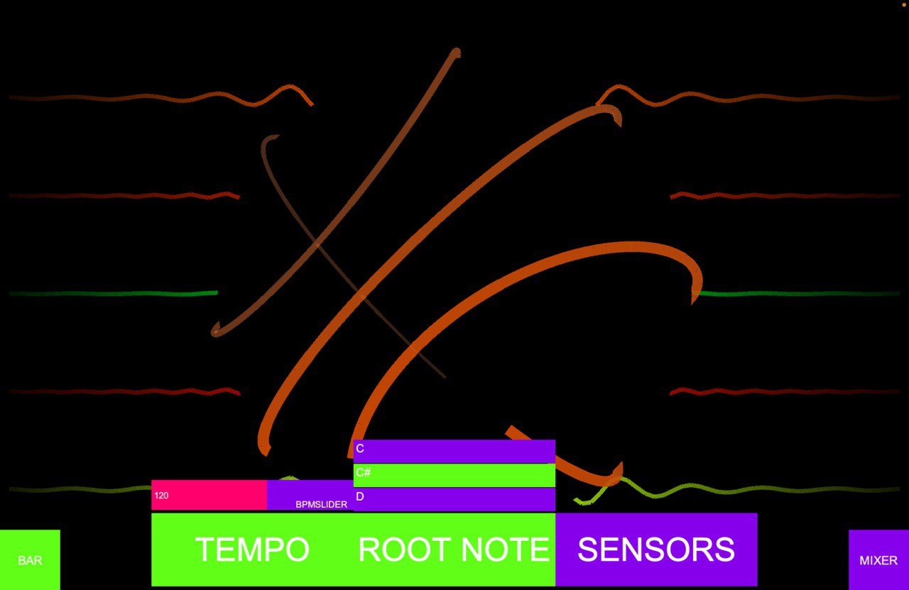
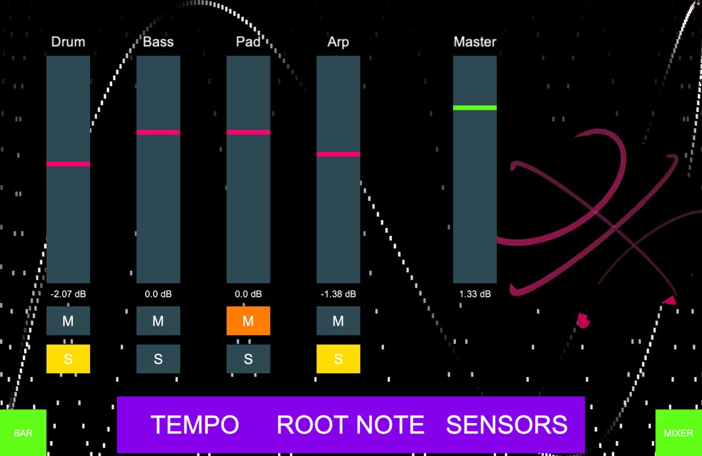
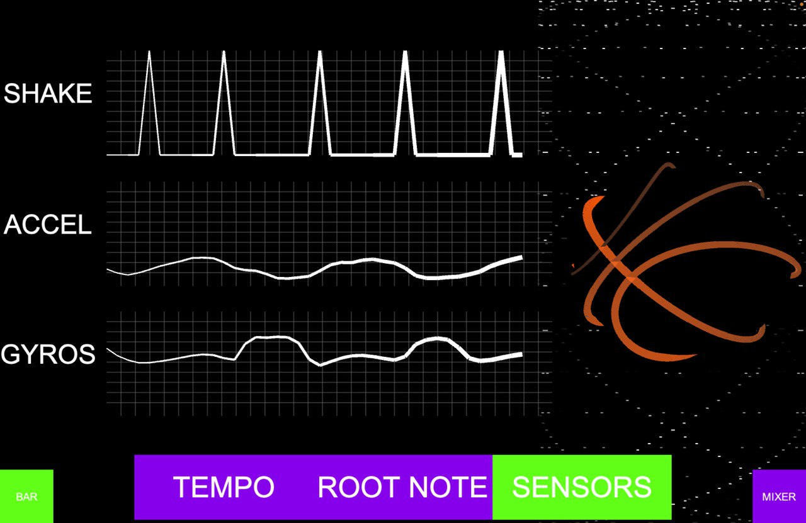
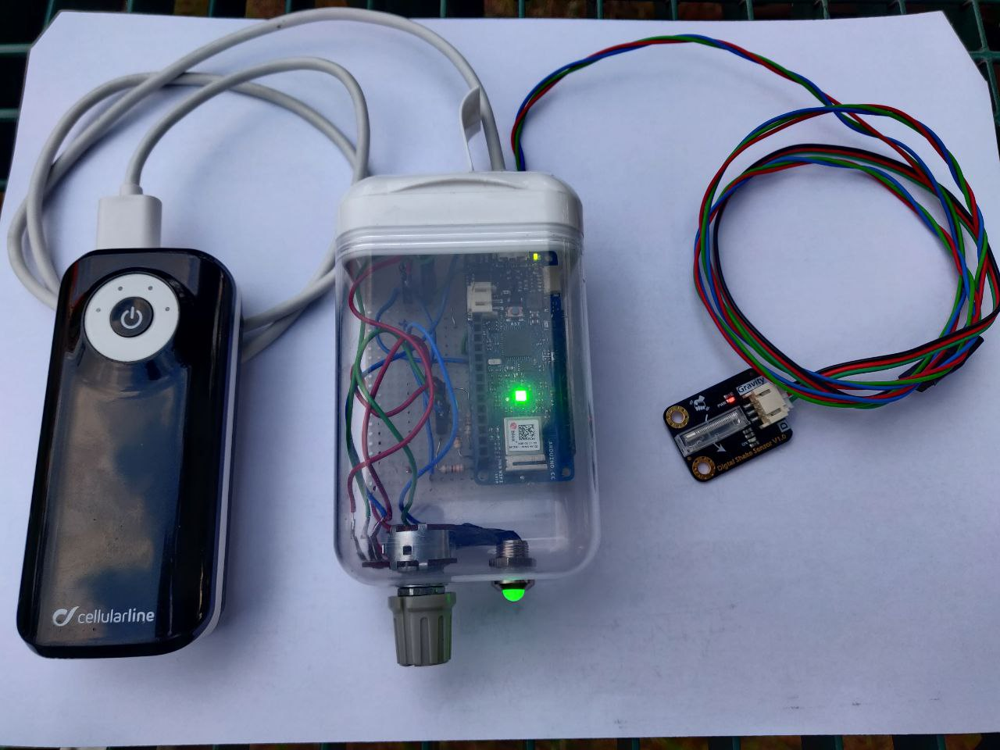

# **BOUNCER**

 <em>Group 5 PLAS</em>

- [**BOUNCER**](#bouncer)
  - [Project Description](#project-description)
  - [Getting Started](#getting-started)
  - [Usage](#usage)
  - [Processing GUI](#processing-gui)
  - [ARDUINO](#arduino)
  - [Folder Structure](#folder-structure)
  - [Notes](#notes)
  - [Components](#components)

## Project Description

Interaction Design Project developed combining [SuperCollider](https://supercollider.github.io/), [Processing](https://processing.org/) and [Arduino](https://www.arduino.cc/) for the course of Computer Music Languages and Systems.

<em>BOUNCER</em> is a system that produces music following the movements of a basketball player, and can provide a pleasant background for a training session. Exploiting the combination of hardware and software interactions the user can manipulate both the music generated by the system and the visuals connected to it.
A complete description of the development of the system can be found in the [report]().

## Getting Started

In order to enjoy the system as intended during the prototypation process:

1. Download and install [SuperCollider](https://supercollider.github.io/).
2. Download and install [Processing](https://processing.org/).
3. Download and install [Arduino IDE](https://www.arduino.cc/).
4. Clone the repository.
5. Open the file basketball.pde inside the folder *Processing*.
6. Make sure to have the following libraries installed (in Sketch > Import Libraries > Manage Libraries):
   -  ControlP5 
   -  Sound
   -  OSCP5
   -  Supercollider
7. Run the file clicking on the *PLAY BUTTON*, (MACOS: cmd+R, Windows: ctrl+R)
8. Open the file basketball.scd inside the folder *SuperCollider*.
9.  In the .scd file run the main code section (MACOS: cmd+enter, Windows: ctrl+enter)
10. Install the [Multisense OSC](https://play.google.com/store/apps/details?id=edu.polytechnique.multisense.release&hl=en_US&gl=US) application on a smartphone device. 
11. Build an arduino based system as specified by the [report]()
12. Load on the arduino the firmware uploaded on the repository in the folder arduino, and update with your own specification for the NETWORK SSID, PASSWORD, IP address for the target PC, and input port.
13. Setup the network access point with static addresses in order to facilitate the OSC communication system.
14. In order to setup the proper audio analysis by Processing the system needs a *virtual audio cable* internal routing from SuperCollider to Processing: the outbus 0-1 from SuperCollider are used for piloting the loudspeaker. The outbus 2-3 are used as  feedback signals to Processing. This routing can be implemented with [VB cables](https://vb-audio.com/Cable/) on windows (NOT fully tested), or with an aggregate device on MACOS, exploiting [BlackHole](https://existential.audio/blackhole/) as virtual audio cable system.
15. Find a basketball Player!!

## Usage

1. Start the Multisense App on the Smartphone and set the correct IP address and port for the PC used as central device.
2. Position the shake sensor connected to the arduino on the dominant hand used by the player and Turn the Arduino on.  
3. Launch Supercollider and Processing scripts. 
4. ENJOY!!

## Processing GUI

The Processing allows the user control some parameters of the CMS in order to manipulate its behaviour.
In particular the available parameters are: 
1. TEMPO: used to speed-up or slow-down 
2. ROOT NOTE: used to select the tonality of the generated music.

The mixer view allows the user to modify the volumes of the instruments generated in SuperCollider, to mute and to solo them.

Choosing the "sensors" button allows to open the page where the values of the sensors are plotted. 

## ARDUINO 
The Arduino device is used to both transmit the data acquired by the shake sensor and to control the volume of the system 

After some tests the best position used to mount the system resulted to be the one showed in the picture below.

## Folder Structure

The repository contains 4 principal folders:
* "arduino" containing the Source code for arduino.
* "Processing" containing the Source code for GUI.
* "SuperCollider" containing the computer Music Engine.
* "gitAssets" contains the images used in the report and in the README.

## Notes

## Components 
Alberto Doimo (alberto.doimo@mail.polimi.it) 

Paolo Ostan (paolo.ostan@mail.polimi.it) 

Stefano Donà (stefano2.dona@mail.polimi.it) 

Lorenzo Curcio (lorenzo.curcio@mail.polimi.it) 

